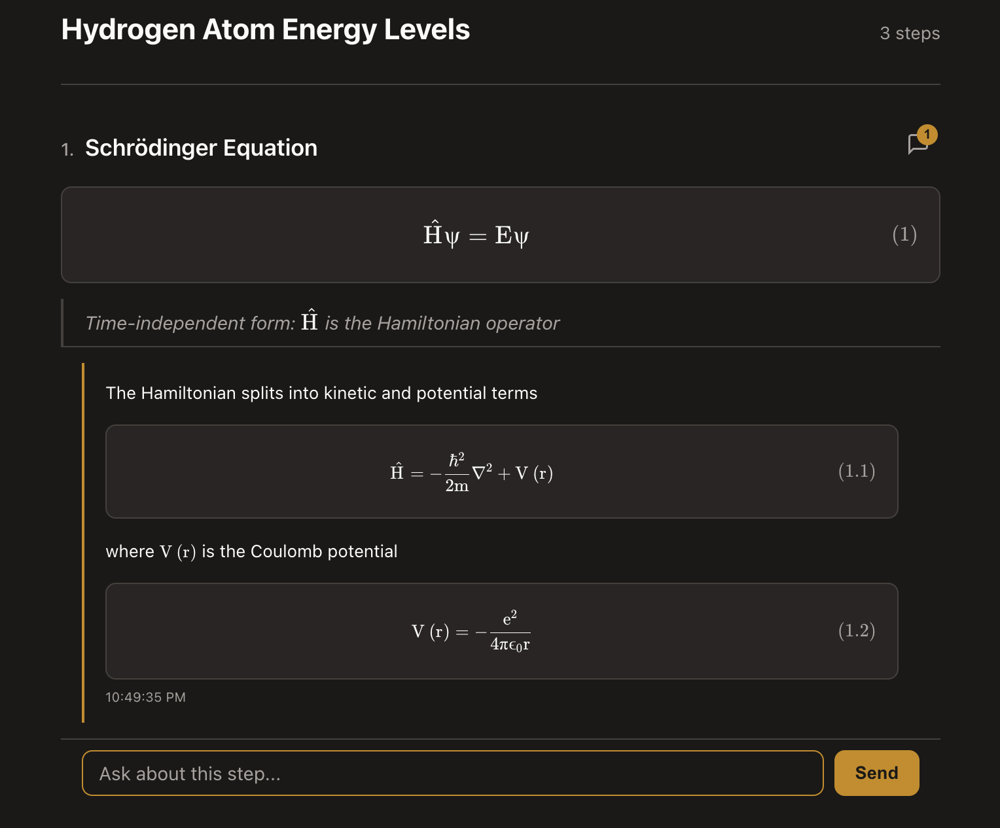

<div align="center">

# CLIBOARD

**Live math whiteboard for your terminal.**

Type LaTeX in the terminal, see publication-quality equations in the browser — with per-step AI chat built in.

A plain markdown+LaTeX document format (`.cb.md`) paired with a display engine that renders interactive, physics-textbook-style math — all from a single Rust binary with zero runtime dependencies.

No API calls. No cloud. No cost. Everything runs locally on your machine.

Built for physicists, mathematicians, and AI agents who work in the terminal.



[](https://www.rust-lang.org/)
[](#)
[](LICENSE)
[](#)
[](#)
[](#)

</div>

---

```bash
cargo install --path .
```

<div align="center">

Works on Mac, Windows, and Linux. Single binary, no runtime dependencies.

</div>

<div align="center">

```
 ┌─────────────────────────────────────────────────────────────────────┐
 │ ● ● ●                        Terminal                              │
 ├─────────────────────────────────────────────────────────────────────┤
 │                                                                     │
 │  ~ $ cliboard new "Hydrogen Atom Energy Levels"                     │
 │  Board live at http://localhost:8377                                 │
 │                                                                     │
 │  ~ $ cliboard step "Schrödinger equation" "\hat{H}\psi = E\psi"    │
 │  Step 1 added: "Schrödinger equation"                               │
 │                                                                     │
 │  ~ $ cliboard step "Expand the Hamiltonian" \                       │
 │        "-\frac{\hbar^2}{2m}\nabla^2\psi + V(r)\psi = E\psi"        │
 │  Step 2 added: "Expand the Hamiltonian"                             │
 │                                                                     │
 │  ~ $ cliboard result "Energy levels" "E_n = -\frac{13.6}{n^2}"     │
 │  Step 3 added: "Energy levels"                                      │
 │                                                                     │
 │  ~ $ █                                                              │
 │                                                                     │
 └─────────────────────────────────────────────────────────────────────┘
```

</div>

Steps appear live in the browser as you type them. Equations are server-side rendered with KaTeX — no client-side JavaScript needed for math.

---

<div align="center">

*"It's like having a physics textbook that writes itself as you think."*

*"Finally, a tool that lets me derive in the terminal and present in the browser."*

*"The AI chat on each equation is a game changer for teaching."*

</div>

---

## How It Works

```
Terminal                           Browser
────────                           ───────

cliboard step "..." "LaTeX"   ──>  .cb.md file
                                      │
                                   file watcher
                                      │
                                   pulldown-cmark → Document model → katex-rs
                                      │
                                   server-side rendered HTML
                                      │
                                   WebSocket push to viewer
                                      │
                                   Beautiful equations appear instantly
```

**Three layers, fully decoupled:**

| Layer | What it does |
|-------|-------------|
| **Input** | CLI commands, direct file edit, AI agent file I/O — anything that writes `.cb.md` |
| **Document** | Markdown + LaTeX with conventions: `##` = steps, `$$` = equations, `>` = notes |
| **Display** | KaTeX server-side rendering, selection, AI chat, auto-scroll, dark mode |

The document format is the interface. Any tool that produces `.cb.md` gets the full display engine for free.

## Features

**Core rendering**
- Server-side KaTeX — math is pre-rendered, browser just displays HTML
- Auto-numbered equations, right-aligned, textbook style
- Inline math (`$...$`) in titles, notes, and prose
- Dark/warm/light themes with toggle
- Self-contained HTML export

**Interactive**
- Select an equation → "Send to terminal" → LaTeX-to-Unicode on clipboard (`Ĥψ = Eψ`)
- Auto-scroll to new steps, pauses when you scroll up
- KaTeX error display — shows raw LaTeX in red card, never crashes

**Per-step AI chat**
- Chat icon on every equation — ask about any step
- AI replies render as textbook continuations with sub-numbered equations `(1.1)`, `(1.2)`
- Selection → "Send to terminal" → text lands in chat input with context
- Hook system: plug in any LLM via `CLIBOARD_REPLY_HOOK`

**Technical**
- Single ~2.3MB Rust binary, no runtime dependencies
- WebSocket for instant updates, HTTP polling fallback
- < 500ms to first board visible, < 300ms per step render
- < 10MB server memory
- Localhost-only (127.0.0.1)

## Quick Start

```bash
# Start a session (opens browser automatically)
cliboard new "My Derivation"

# Add content from another terminal
cliboard step "Title" "\latex"
cliboard note "Annotation text with $inline$ math"
cliboard result "Final Answer" "\latex"

# Export when done
cliboard export derivation.html
```

## Per-Step AI Chat

Each step has a collapsible chat thread. Click the speech bubble icon to ask about any equation.

**From the browser:**
1. Click the chat icon on a step
2. Type your question and hit Send
3. AI answers right in the thread — with rendered equations numbered `(1.1)`, `(1.2)`, ...

**From the terminal:**
```bash
cliboard chat              # see pending questions
cliboard reply 1 'The eigenvalues satisfy $$E_n = -\frac{13.6}{n^2}$$ for $n = 1, 2, 3, ...$'
cliboard listen --json     # stream new questions to stdout
```

**Auto-reply with any LLM:**

```bash
export CLIBOARD_REPLY_HOOK="./chat-hook.sh"
cliboard new "My Derivation"
```

```bash
#!/bin/bash
# chat-hook.sh — receives CLIBOARD_STEP_ID, CLIBOARD_QUESTION, CLIBOARD_CONTEXT
ANSWER=$(echo "$CLIBOARD_QUESTION" | claude --print)
cliboard reply "$CLIBOARD_STEP_ID" "$ANSWER"
```

## Document Format (.cb.md)

Standard markdown + LaTeX. Write it by hand, with CLI commands, or with any agent:

```markdown
---
title: Hydrogen Atom Energy Levels
---

## Time-independent Schrödinger equation

$$\hat{H}\psi = E\psi$$

> The starting point for any quantum mechanics problem.

## Expand the Hamiltonian

$$-\frac{\hbar^2}{2m}\nabla^2\psi + V(r)\psi = E\psi$$

> Kinetic energy operator plus potential energy.

---

## Energy levels {.result}

$$E_n = -\frac{13.6 \text{ eV}}{n^2}$$

> The $1/n^2$ dependence matches the Balmer series.
```

| Syntax | Meaning |
|--------|---------|
| `---` (YAML) | Frontmatter with `title` and optional `theme` |
| `## Title` | Numbered step |
| `## Title {.result}` | Highlighted result box |
| `$$...$$` | Display equation (auto-numbered) |
| `$...$` | Inline math (in titles, notes, prose) |
| `> text` | Annotation/note |
| Plain paragraph | Unnumbered prose |
| `---` | Section divider |

## CLI Reference

| Command | Description |
|---------|-------------|
| `cliboard new "Title"` | Start a session and open the board |
| `cliboard step "Title" "\latex"` | Add a numbered step with an equation |
| `cliboard eq "\latex"` | Add an equation to the current step |
| `cliboard note "text"` | Add an annotation (supports `$inline$` math) |
| `cliboard text "text"` | Add a prose paragraph |
| `cliboard result "Title" "\latex"` | Add a highlighted result box |
| `cliboard divider` | Add a section divider |
| `cliboard render "\latex"` | Quick one-shot render (no session) |
| `cliboard export file.html` | Export as self-contained HTML |
| `cliboard chat` | Show pending chat questions |
| `cliboard reply N "text"` | Reply to a question on step N |
| `cliboard listen` | Watch for new questions (blocking) |
| `cliboard selection` | Read last selection from the board |
| `cliboard status` | Show session status |
| `cliboard stop` | Stop the server |
| `cliboard update` | Update to the latest version |
| `cliboard update --check` | Check for updates without installing |

## Selection and Send-to-Terminal

Select text on the board. Two buttons appear:

- **Send to terminal** — converts LaTeX to Unicode, pastes into chat input with step context
- **Ask about this** — opens the chat for that step, pre-filled with your selection

Read the current selection programmatically:
```bash
cliboard selection          # human-readable
cliboard selection --json   # full JSON
cliboard selection --latex  # raw LaTeX
```

## Architecture

```
.cb.md  →  pulldown-cmark  →  Document model  →  katex-rs  →  HTML  →  browser
                                                                ↑
                                                        server-side rendering
```

- **Language**: Rust — single binary, no runtime dependencies
- **Math**: Server-side KaTeX via `katex-rs` (no client JS for math)
- **Server**: `tiny_http` (synchronous, localhost-only on 127.0.0.1)
- **Updates**: WebSocket via `tungstenite`, with HTTP polling fallback
- **Markdown**: `pulldown-cmark` with math + heading attributes
- **Assets**: `rust-embed` (KaTeX CSS + 20 woff2 fonts compiled into binary)
- **File watching**: `notify` (cross-platform fs events)
- **Viewer**: Vanilla HTML/CSS/JS, no framework (< 20KB)

## Performance

| Metric | Target |
|--------|--------|
| `cliboard new` to board visible | < 500ms |
| `cliboard step` to rendered | < 300ms |
| Server memory | < 10MB |
| Binary size (release) | ~2.3MB |

---

<div align="center">

[Quick Start](#quick-start) · [AI Chat](#per-step-ai-chat) · [Document Format](#document-format-cbmd) · [CLI Reference](#cli-reference) · [Architecture](#architecture)

MIT License

</div>
